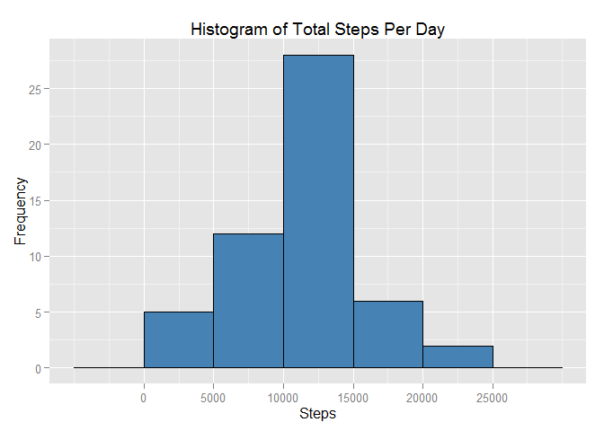
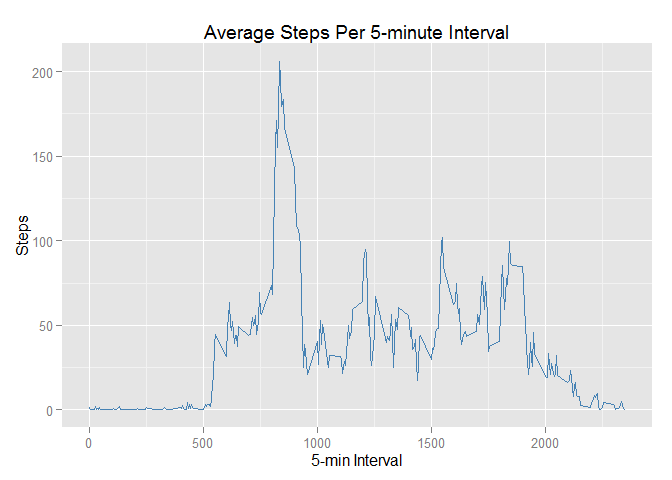
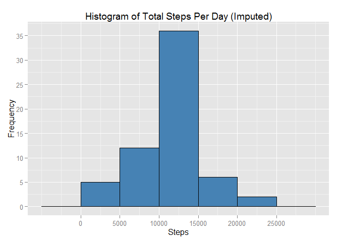
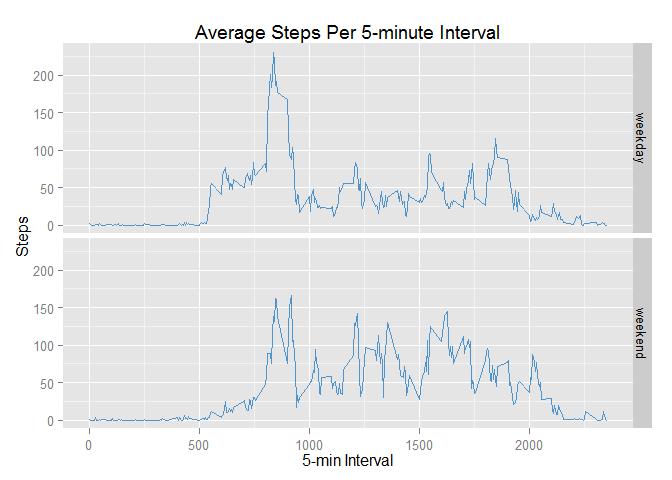

# Reproducible Research: Peer Assessment 1

```r
library(knitr)
library(ggplot2)
opts_chunk$set(echo = TRUE, fig.path = "figure/")
```

## Loading and preprocessing the data
Load the activity monitoring data into a data frame:

```r
unzip("activity.zip")
activityData <- read.csv("activity.csv")
```


## What is mean total number of steps taken per day?
Compute the sum of steps by date and draw a histogram:

```r
stepsPerDay <- aggregate(steps ~ date, activityData, sum)
ggplot(stepsPerDay, aes(x = steps)) +
    geom_histogram(fill = "steelblue", col = "black", binwidth = 5000) +
    ggtitle("Histogram of Total Steps Per Day") +
    scale_x_continuous(breaks = seq(0, 25000, 5000)) + xlab("Steps") +
    scale_y_continuous(breaks = seq(0, 40, 5)) + ylab("Frequency")
```

 

Calculate the mean and the median, omitting days which have no data available:

```r
dayMean <- round(mean(stepsPerDay$steps, na.rm = TRUE), 2)
dayMedian <- median(stepsPerDay$steps, na.rm = TRUE)
options(scipen = 999) # avoid scientific notation in output
```

The **mean** of total number of steps taken each day (rounded to two decimals)
is **10766.19**.

The **median** of total number of steps taken each day is **10765**.


## What is the average daily activity pattern?
Compute the mean of steps by 5-minute interval and draw a time series plot:

```r
stepsPerInterval <- aggregate(steps ~ interval, activityData, mean)
ggplot(stepsPerInterval, aes(x = interval, y = steps)) +
    geom_line(colour = "steelblue") +
    ggtitle("Average Steps Per 5-minute Interval") +
    xlab("5-min Interval") + ylab("Steps")
```

 

Find the 5-min interval containing the highest number of steps on average:

```r
maxSteps <- max(stepsPerInterval$steps)
maxInterval <- stepsPerInterval[stepsPerInterval$steps == maxSteps, ]$interval
```

5-minute interval **835** contains the maximum number
(~ 206) of steps on average.


## Imputing missing values
Calculate and report the total number of missing values in the
dataset (i.e. the total number of rows with NAs):

```r
naCount <- sum(is.na(activityData$steps))
```
Number of missing values in the activity data set is **2304**.

Create a new dataset that is equal to the original dataset but with the
missing data filled in, using the 5-min interval averages:

```r
imputedData <- activityData
for (row in which(is.na(imputedData$steps))) {
    imputedData[row, "steps"] <- stepsPerInterval[
        stepsPerInterval$interval == imputedData[row, "interval"], ]$steps
}
```

Compute the sum of steps by date for the imputed data set and draw a histogram:

```r
stepsPerDayImp <- aggregate(steps ~ date, imputedData, sum)
ggplot(stepsPerDayImp, aes(x = steps)) +
    geom_histogram(fill = "steelblue", col = "black", binwidth = 5000) +
    ggtitle("Histogram of Total Steps Per Day (Imputed)") +
    scale_x_continuous(breaks = seq(0, 25000, 5000)) + xlab("Steps") +
    scale_y_continuous(breaks = seq(0, 40, 5)) + ylab("Frequency")
```

 

Calculate the mean and the median for the imputed data set:

```r
dayMeanImp <- round(mean(stepsPerDayImp$steps), 2)
dayMedianImp <- round(median(stepsPerDayImp$steps), 2)
```

The **mean** of total number of steps taken each day (rounded to two decimals)
for the imputed data set is **10766.19**.

The **median** of total number of steps taken each day (rounded to two decimals)
for the imputed data set is **10766.19**.

Imputing missing values using the 5-min interval averages does not affect
the mean total number of steps taken per day. Imputing has a slight effect
on the median.


## Are there differences in activity patterns between weekdays and weekends?
Create a new factor variable in the imputed dataset with two levels,
"weekday" and "weekend", indicating whether a given date is a weekday
or a weekend day:

```r
Sys.setlocale("LC_TIME", "C") # use English day names
imputedData$daytype <- factor(
    ifelse(weekdays(as.POSIXlt(imputedData$date)) %in% c("Saturday", "Sunday"),
           "weekend", "weekday"))
```

Compute the mean of steps by 5-minute interval for both weekdays and weekends.
Make a panel plot containing a time series plot of the 5-minute interval
(x-axis) and the average number of steps taken, averaged across all weekday
days or weekend days (y-axis):


```r
stepsPerDaytype <- aggregate(steps ~ interval + daytype, imputedData, mean)
ggplot(stepsPerDaytype, aes(x = interval, y = steps)) +
    geom_line(colour = "steelblue3") + facet_grid(daytype ~ .) +
    ggtitle("Average Steps Per 5-minute Interval") +
    xlab("5-min Interval") + ylab("Steps")
```

 
